<!--
  This is the profile README, not the portfolio site's.

  Copy the four files next to it (README.md, contrib-heatmap.svg,
  ascii-portrait.svg, info-card.svg) into the root of the luccahp1/luccahp1
  repo, along with .github/workflows/update-profile-art.yml, and GitHub renders
  it at the top of the profile page. The image paths are relative, so they work
  in both places.

  Everything that moves is SMIL or CSS keyframes inside the SVGs. GitHub strips
  <script> from READMEs and sanitizes inline CSS, but it renders SVGs embedded
  with  and plays their animations. That constraint is the whole design.

  Widths are load-bearing: 370 + 490 = 860, so the portrait and the card line up
  with the heatmap's edges. Only   gives vertical space here; style="" is
  stripped, and <h1>/<h2> draw a full-width rule, which is why every heading
  below is an <h3>.
-->

<h3><code>lucca@github ~ $ ./contributions.sh</code></h3>

  

<h3><code>lucca@github ~ $ whoami</code></h3>

<table>
  <tr>
    <td valign="top"></td>
    <td valign="top"></td>
  </tr>
</table>

 

<h3><code>lucca@github ~ $ cat links.txt</code></h3>

<a href="https://luccahp1.github.io/portfolio/">portfolio</a> ·
<a href="https://luccahp1.github.io/portfolio/resume.html">resume</a> ·
<a href="mailto:luccaprada25@gmail.com">email</a>

  

No stats services and no token. Three Python scripts draw these SVGs, a cron
scrapes the public contribution calendar every morning, and the art is committed
to the repo, so nothing here can go down or rate-limit on me.
<a href="https://github.com/luccahp1/portfolio/tree/main/scripts">Source.</a>

